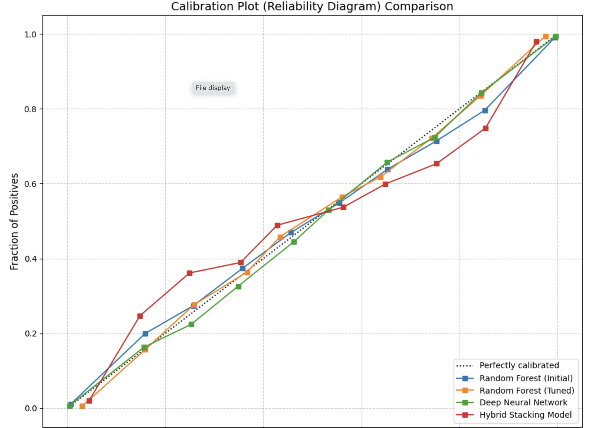
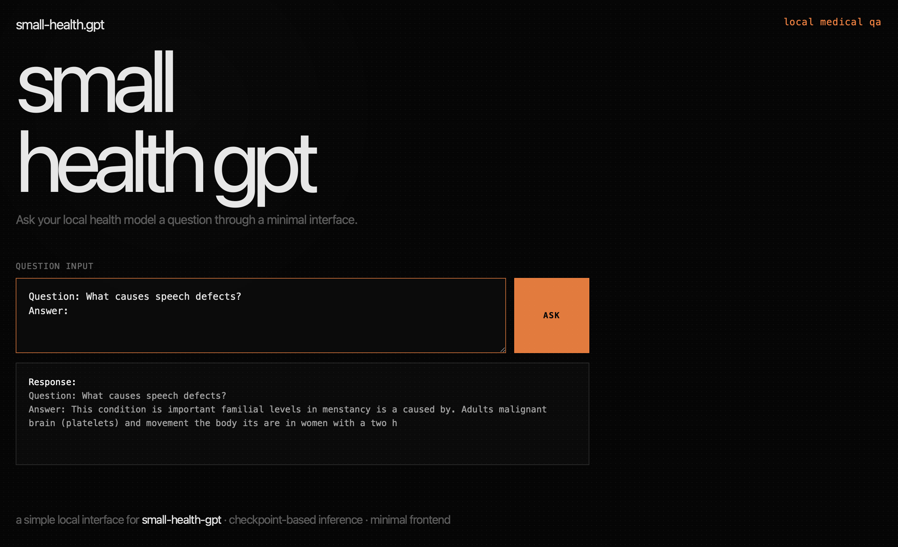
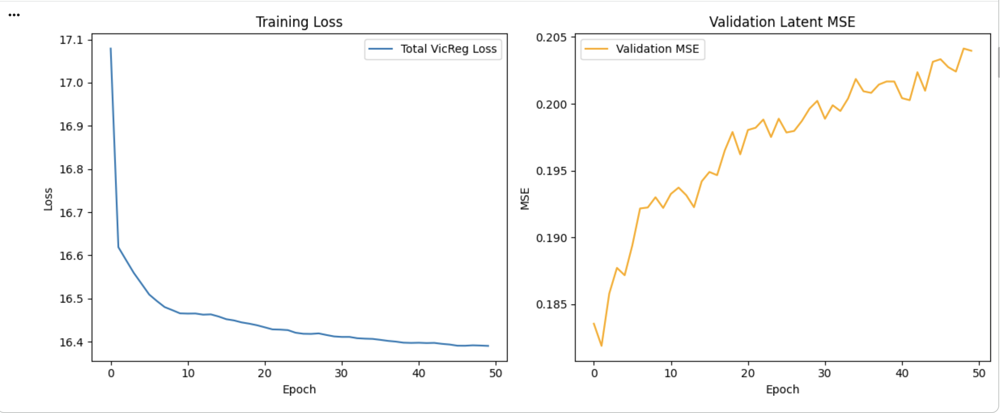

# Machine Learning Projects

A collection of ML projects — from classical models to transformers and self-supervised learning.

---

## Projects

### 1. Wimbledon Match Prediction

Predicts Wimbledon match outcomes using Random Forest and neural networks.

### 2. Small Health GPT

A small GPT-style transformer trained on health Q&A, with a backend API and frontend interface.

### 3. Tic-Tac-Toe JEPA

A Joint Embedding Predictive Architecture that learns to play Tic-Tac-Toe by predicting future latent states — no rewards needed. Achieved 100% win rate against a depth-limited Minimax expert.

---

## Disclaimer

Small Health GPT is for educational purposes only. Not a substitute for professional medical advice.
